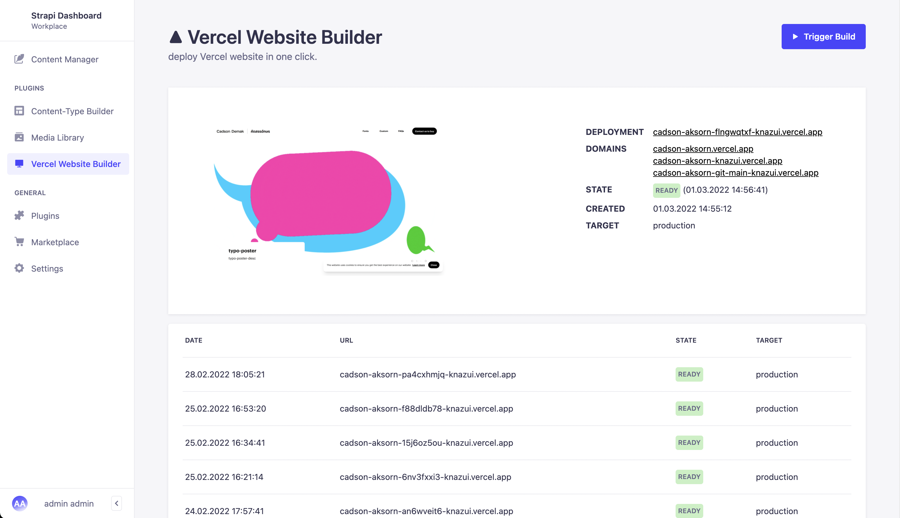

# strapi-vercel-plugin-website-builder

<p>
    <!-- <a href="https://github.com/f00b4r/strapi-vercel-website-builder/actions">
        
    </a> -->
    <a href="https://www.npmjs.com/package/strapi-vercel-website-builder">
        
    </a>
    <a href="https://www.npmjs.com/package/strapi-vercel-website-builder">
        
    </a>
    <a href="/LICENSE">
        
    </a>
</p>



## Overview 

Building website on Vercel, for Strapi V4. in case you want to use Vercel as a platform for your website built on Strapi, without this plugin you can use webhook, but it can trigger a lot of pipelines. With this plugin, you will have a recreation of the vercel dashboard on your strapi dashboard, with which you can easily trigger deploys.

## Requirements

The installation requirements are the same as Strapi itself and can be found in the documentation on the [Quick Start](https://strapi.io/documentation/developer-docs/latest/getting-started/quick-start.html) page in the Prerequisites info card.

### Supported Strapi versions

- v4.x.x

## Installation

```sh
npm install strapi-vercel-plugin-website-builder
```

**or**

```sh
yarn add strapi-vercel-plugin-website-builder
```

## Configuration

The plugin configuration is stored in a config file located at `./config/plugins.js`.


### Manual Configuration

```javascript

`./config/plugins.js`

module.exports = ({ env }) => ({
	'vercel-website-builder': {
		enabled: true,
		config: {
			projectId: env('VERCEL_PROJECT_ID'),
			teamId: env('VERCEL_TEAM_ID'), // optional: if project owner is a team
			apiToken: env('VERCEL_TOKEN'),
			triggers: {
				production: env('VERCEL_TRIGGER_PRODUCTION'),
				type: 'manual',
			},
		},
	},
});
```

## Usage

Once the plugin has been installed and configured, it will show in the sidebar as `Vercel Website Builder`.
To trigger a manual build select the `Vercel Website Builder` menu item in the sidebar and click
the `Trigger Build` button to start a build process.

## Bugs

If any bugs are found please report them as a [Github Issue](https://github.com/karnpapon/strapi-vercel-plugin-website-builder/issues)
